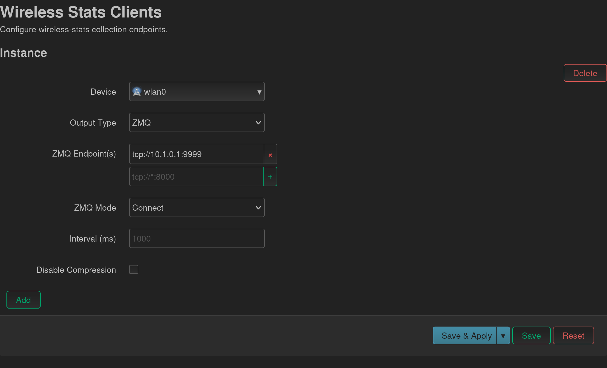

# Wireless Telemetry

**DRAFT**

This project implements a wireless telemetry collection agent akin to what stock `iw` provides as well as some features that `collectd`'s `ping` module provides. The main difference are:

1. direct to json output - no need to scrape and parse `iw` output
2. network options: tcp, udp, and zmq, as well as standard output streams
3. ~~fast~~ this utility isn't necessarily faster than raw collection, however it *is* faster than raw collection + screen scraping

 ‼️ DISCLAIMER ‼️

*This project is a prototype that has been built for quick deployment. It relies on custom built toolchains from [buildroot](https://buildroot.org/) because there was some device incompatibility from the device specific toolchains provided by openwrt project (specifically around compiler support). As a result of this, this project does not integrate into the recommended openwrt workflows (specifically Makefile driven ipk generation). This may or may not be addressed in the future depending on community uptake, however at present, the current project as it is hosted in this org has the CI to manually generate the necessary releases (for two specific devices: armv7 and mips_24kc). These toolchains can be found at [github.com/rabit-wisp/toolchain](https://github.com/rabit-wisp/toolchain)*

## Usage as a service

Usage as service: create as many instances as you wish (on as many wireless interfaces).



## CLI usage

Package ships a binary `wireless-stats` which can be directly called like so

```bash
wireless-stats
Usage:
  wireless-stats <interface> --tcp --dest-ip=<ip> --dest-port=<port> [options]
  wireless-stats <interface> --udp --dest-ip=<ip> --dest-port=<port> [options]
  wireless-stats <interface> --zmq --endpoint=<endpoint> [--mode=(connect|bind)] [--hostname-tag] [options]
  wireless-stats <interface> --stdout [options]
  wireless-stats <interface> --stderr [options]

Options:
  --stdout               output to stdout
  --stderr               output to stdout
  --udp                  send over udp
  --tcp                  send over tcp
  --zmq                  send over zmq
  --dest-ip=<ip>         Destination IPv4 address.
  --dest-port=<port>     Destination UDP port.
  --endpoint=<endpoint>  zmq endpoint (e.g. tcp://*:8000)
  --mode=<mode>          zmq connection mode [default: connect]
  --interval=<sec>       milliseconds between samples [default: 1000].
  --count=<count>        only do count number of polls [default: 0]
  --no-compress          don't gzip content

```

## Output

```
~# wireless-stats wlan0 --count=1 --stdout --no-compress | jq ". | keys"
[
  "hostname", # hostname of this device - usefull at collection point
  "sent",     # unix epoch timestamp of when the payload was sent
  "ping",     # dictionary of ping statistics
  "pppoe",    # pppoe service statistic 
  "stations", # array of stations (these are clients connected to the AP) - equivalent of iw wlan0 station dump
  "wireless"  # dictionary of frequency stats equivalent of iw wlan0 survey dump
]
```

## Example telegraf ingest

```
[[inputs.socket_listener]]
  service_address    = "tcp://0.0.0.0:25827"
  read_buffer_size   = "10MB"
  data_format        = "xpath_json"
  xpath_native_types = true
  xpath_allow_empty_selection = true
  # ---- wireless summary ----------------------------------------------------
  [[inputs.socket_listener.xpath]]
    alias = "radio"
    metric_selection  = "/wireless/*"     # picks the wireless object
    metric_name       = "'radio'"
    timestamp = "sent"
    timestamp_format = "unix"
    [inputs.socket_listener.xpath.tags]
      source = "/hostname"
      channel = "name()"                  # e.g. 5180, 5200 …

    # -------- fields ----------
    [inputs.socket_listener.xpath.fields]     # non-integer / boolean
      active = "active"                       # true / false

    [inputs.socket_listener.xpath.fields_int] # every int64 you need
      noise          = "noise"
      total_time     = "time/total"
      busy_time      = "time/busy"
      ext_busy_time  = "time/ext_busy"
      rx_time        = "time/rx"
      tx_time        = "time/tx"

  # # ---- one metric per ping link -----------------------------------------
  [[inputs.socket_listener.xpath]]
    alias             = "ping"
    metric_selection  = "/ping/*"
    metric_name       = "'ping'"
    timestamp = "sent"
    timestamp_format = "unix"
    [inputs.socket_listener.xpath.tags]
      source = "/hostname"
      host = "name()"
    [inputs.socket_listener.xpath.fields_int]
      latency          = "."


  # # ---- one metric per pppoe link -----------------------------------------
  [[inputs.socket_listener.xpath]]
    alias             = "pppoe"
    metric_selection  = "/pppoe/*"
    metric_name       = "'pppoe'"
    timestamp = "sent"
    timestamp_format = "unix"
    field_selection   = "*"            # all keys as fields

    [inputs.socket_listener.xpath.tags]
      source = "/hostname"
      iface = "interface"
      mac   = "remote-mac"

  # ---- one metric per station ----------------------------------------------
  [[inputs.socket_listener.xpath]]
    alias = "station"
    metric_selection  = "/stations/*"   # iterates over array items
    metric_name       = "'station'"
    timestamp = "sent"
    timestamp_format = "unix"

    [inputs.socket_listener.xpath.tags]
      source = "/hostname"
      iface = "interface"
      mac   = "mac_address"

    # -------- fields ----------
    [inputs.socket_listener.xpath.fields]     # non-integer / boolean
      authorized             = "flags/authorized"
      authenticated          = "flags/authenticated"
      associated             = "flags/associated"
      tx_short_gi            = "tx_bitrate/short_gi"
      tx_width_40mhz         = "tx_bitrate/width_40mhz"
      tx_width_80mhz         = "tx_bitrate/width_80mhz"
      rx_short_gi            = "rx_bitrate/short_gi"
      rx_width_40mhz         = "rx_bitrate/width_40mhz"
      rx_width_80mhz         = "rx_bitrate/width_80mhz"

    [inputs.socket_listener.xpath.fields_int]
      signal_dbm             = "signal_dbm"
      #antenna_1_signal_dbm   = "chain_signal[1]"
      #antenna_2_signal_dbm   = "chain_signal[2]"
      signal_avg_dbm         = "signal_avg_dbm"
      #antenna_1_signal_avg_dbm   = "chain_signal_avg[1]"
      #antenna_2_signal_avg_dbm   = "chain_signal_avg[2]"

      current_time_ms        = "current_time_ms"
      inactive_time_ms       = "inactive_time_ms"
      tx_bitrate             = "tx_bitrate/rate_mbps_x10"
      tx_vht_mcs             = "tx_bitrate/vht_mcs"
      tx_vht_nss             = "tx_bitrate/vht_nss"
      rx_bitrate             = "rx_bitrate/rate_mbps_x10"
      rx_vht_mcs             = "rx_bitrate/vht_mcs"
      rx_vht_nss             = "rx_bitrate/vht_nss"
      rx_bytes               = "rx_bytes"
      rx_packets             = "rx_packets"
      tx_bytes               = "tx_bytes"
      tx_packets             = "tx_packets"
      tx_retries             = "tx_retries"
      tx_failed              = "tx_failed"
      rx_drop_misc           = "rx_drop_misc"
      tx_duration_us         = "tx_duration_us"
      rx_duration_us         = "rx_duration_us"
      last_ack_signal_dbm    = "last_ack_signal_dbm"
      avg_ack_signal_dbm     = "avg_ack_signal_dbm"
      airtime_weight         = "airtime_weight"
      connected_time_sec     = "connected_time_sec"
      assoc_at_boottime_us   = "assoc_at_boottime_us"
      assoc_at_ms            = "assoc_at_ms"

  # ---- one metric per station tid stat ----------------------------------------
  [[inputs.socket_listener.xpath]]
    alias                 = "tid"
    metric_selection      = "/stations/*/tid_stats/*"
    metric_name           = "'tid'"
    timestamp             = "sent"
    timestamp_format      = "unix"

    [inputs.socket_listener.xpath.tags]
      source              = "/hostname"
      iface               = "../../interface"
      mac                 = "../../mac_address"
      tid                 = "tid"

    [inputs.socket_listener.xpath.fields_int]
      rx_msdu                 = "rx_msdu"
      tx_msdu                 = "tx_msdu"
      tx_msdu_retries         = "tx_msdu_retries"
      tx_msdu_failed          = "tx_msdu_failed"
      backlog_bytes           = "txq_stats/backlog_bytes"
      backlog_packets         = "txq_stats/backlog_packets"
      flows                   = "txq_stats/flows"
      drops                   = "txq_stats/drops"
      ecn_marks               = "txq_stats/ecn_marks"
      overlimit               = "txq_stats/overlimit"
      collisions              = "txq_stats/collisions"
      tx_bytes                = "txq_stats/tx_bytes"
      tx_packets              = "txq_stats/tx_packets"
```

## Development and building locally

### Building binaries

To build, do the following:

```bash
mkdir -p build/{x86,armv7,mips}
cd build/armv7
cmake -DCMAKE_TOOLCHAIN_FILE=../../cmake/toolchains/armv7l-toolchain.cmake ../../
make
# arm cross-compiled binaries are now in ./binaries/*
cd build/mips
cmake -DCMAKE_TOOLCHAIN_FILE=../../cmake/toolchains/mips-toolchain.cmake ../../
make
# mips cross-compiled binaries are now in ./binaries/*

cd build/x86
cmake ../../
make
# non-cross compiled libraries are in ./binaries/*
```

**Note on toolchains:** cmake toolchain fiels are provided and expect the buildroot toolchain to be placed in the project root directory. To see how they are configured and built, see [github.com/rabit-wisp/toolchain](https://github.com/rabit-wisp/toolchain).

`set(TOOLCHAIN_DIR "${CMAKE_CURRENT_LIST_DIR}/../../arm-buildroot-linux-musleabihf_sdk-buildroot/")`

### Building ipk's

The scripts found under `./scripts` will build the pakcages given that binaries have already been built. They are dumb scripts and do not manage dependencies at all.

### The whole thing

See workflow file `.github/workflows/main.yml` for an end-to-end build of the project.
